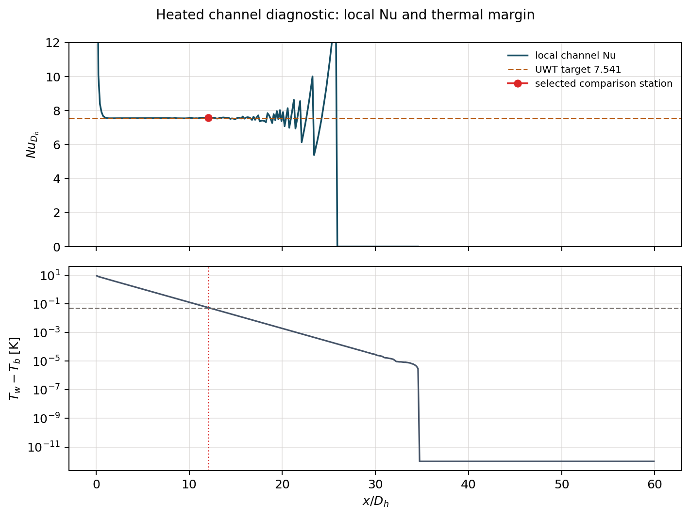

# 003_data_heated_channel_solver_check summary

| quantity | value |
|---|---:|
| latest time | 40.0014 s |
| T min | 293.1744 K |
| T max | 303.1500 K |
| cells below inlet T | 0.00% |
| cells above wall T | 0.00% |
| selected x/Dh | 12.083 |
| selected bulk T | 303.0970 K |
| selected Tw - Tbulk | 0.05299 K |
| selected local Nu | 7.5643 |
| outlet bulk T | 303.1500 K |
| outlet Tw - Tbulk | -5.684e-14 K |
| outlet-local Nu | nan |
| target Nu | 7.5410 |
| Nu error | +0.31% |
| Nu profile plot | `plots/V2_channel_Re100_Nu_profile.png` |

## Reading

- The selected Nu uses the furthest x-station that is both downstream and still numerically well conditioned.
- The outlet Nu is reported separately because a saturated outlet makes Tw - Tbulk too small for a stable denominator.
- The first pass/fail check is boundedness of T in the known physical interval.
