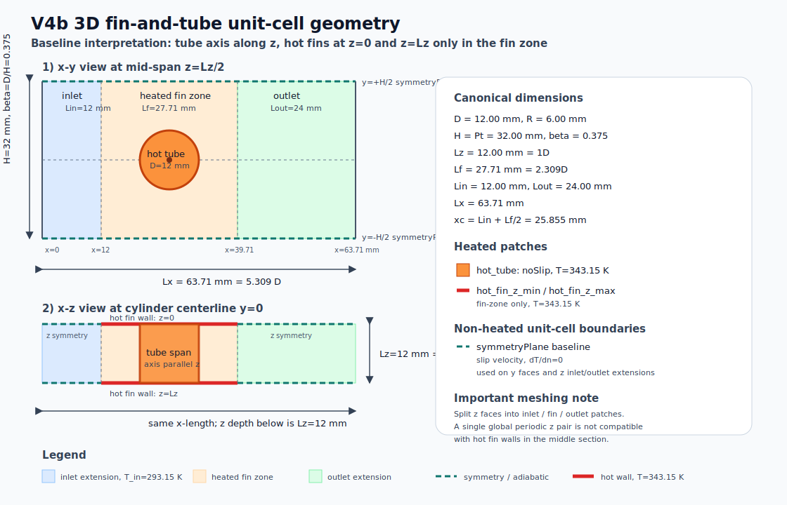

# V4b 3D Production Case

## Objective

This document is the canonical technical description for the full 3D thermal production case.

The current target geometry is a single fin-pitch unit cell of a fin-and-tube heat exchanger:
air flows in the streamwise `x` direction, the transverse pitch is represented by the `y`
extent, and the fin-to-fin spacing is represented by the `z` extent.



## Coordinate system

| direction | meaning | domain interval |
|---|---|---:|
| `x` | streamwise air-flow direction | `0 <= x <= Lx` |
| `y` | transverse tube-pitch direction | `-H/2 <= y <= H/2` |
| `z` | fin-pitch / tube-axis direction | `0 <= z <= Lz` |

The same geometry may also be written with `0 <= y <= H`; in that convention the cylinder
center is at `y = H/2`.

## Accepted dimensions

| quantity | symbol | value | normalized value |
|---|---:|---:|---:|
| tube/cylinder diameter | `D` | `12.00 mm` | `1.000 D` |
| cylinder radius | `R = D/2` | `6.00 mm` | `0.500 D` |
| transverse pitch / channel height | `H = Pt` | `32.00 mm` | `2.667 D` |
| blockage ratio | `beta = D/H` | `0.375` | `-` |
| fin pitch / spanwise domain depth | `Lz` | `12.00 mm` | `1.000 D` |
| heated fin-zone length | `Lf` | `27.71 mm` | `2.309 D` |
| inlet extension | `Lin` | `24.00 mm` | `2.000 D` |
| outlet extension | `Lout` | `60.00 mm` | `5.000 D` |
| total streamwise length | `Lx = Lin + Lf + Lout` | `111.71 mm` | `9.309 D` |
| physical fin thickness | `tf` | `0.14 mm` | `0.0117 D` |

The fin thickness is not meshed as a solid volume in the baseline CFD model. The fins are
represented as constant-temperature wall boundary patches on the two `z` planes.

## Derived positions

| item | value |
|---|---:|
| inlet region | `0 <= x < 24.00 mm` |
| heated fin region | `24.00 <= x <= 51.71 mm` |
| outlet region | `51.71 < x <= 111.71 mm` |
| cylinder center, `x` | `xc = Lin + Lf/2 = 37.855 mm` |
| cylinder center, centered `y` convention | `yc = 0.000 mm` |
| cylinder center, positive `y` convention | `yc = 16.000 mm` |
| cylinder axis | parallel to `z` |
| cylinder span | full `0 <= z <= 12.00 mm` fin pitch |

The cylinder is centered in the heated fin region. Its cross-section in the `x-y` plane is
defined by:

```text
(x - xc)^2 + y^2 = R^2
```

using the centered `y` convention. In the positive `y` convention:

```text
(x - xc)^2 + (y - H/2)^2 = R^2
```

## Heated surfaces

The baseline thermal model uses a constant wall temperature:

```text
T_hot = 343.15 K  = 70 C
T_in  = 293.15 K  = 20 C
Delta T = 50 K
```

Heated surfaces:

- cylinder/tube wall, full span `0 <= z <= Lz`
- fin wall at `z = 0`, only in the heated fin region `Lin <= x <= Lin + Lf`
- fin wall at `z = Lz`, only in the heated fin region `Lin <= x <= Lin + Lf`

The inlet and outlet extensions are not heated fin surfaces.

## Boundary-condition plan

The `z` faces must be split into separate patches because the fin region is a hot solid wall,
while the inlet and outlet extensions are not fins.

| boundary / patch | velocity | temperature | pressure |
|---|---|---|---|
| inlet, `x = 0` | fixed inlet velocity `U = (Uin, 0, 0)` | `fixedValue 293.15 K` | `zeroGradient` |
| outlet, `x = Lx` | `zeroGradient` or `inletOutlet` | `zeroGradient` or `inletOutlet` | fixed reference pressure |
| cylinder wall | `noSlip` | `fixedValue 343.15 K` | `zeroGradient` |
| fin walls, `z = 0/Lz`, fin region only | `noSlip` | `fixedValue 343.15 K` | `zeroGradient` |
| `z = 0/Lz`, inlet and outlet extensions | `symmetryPlane` baseline | no heat flux through symmetry plane | symmetry-plane pressure condition |
| `y = +/-H/2` | `symmetryPlane` baseline | no heat flux through symmetry plane | symmetry-plane pressure condition |

If the final physical model requires solid channel walls at `y = +/-H/2`, replace the baseline
`symmetryPlane` treatment there with `noSlip` and the selected thermal wall condition. For the
current fin-and-tube unit-cell interpretation, `y = +/-H/2` represents transverse symmetry between
neighboring tube rows.

## OpenFOAM-style patch intent

The exact patch names can change during meshing, but the intended split is:

```text
inlet
outlet
symmetry_y_min
symmetry_y_max
symmetry_z_min_inlet
symmetry_z_min_outlet
symmetry_z_max_inlet
symmetry_z_max_outlet
hot_fin_z_min
hot_fin_z_max
hot_tube
```

Example thermal intent:

```text
inlet
{
    type  fixedValue;
    value uniform 293.15;
}

hot_tube
{
    type  fixedValue;
    value uniform 343.15;
}

hot_fin_z_min
{
    type  fixedValue;
    value uniform 343.15;
}

hot_fin_z_max
{
    type  fixedValue;
    value uniform 343.15;
}

symmetry_y_min
{
    type symmetryPlane;
}

symmetry_y_max
{
    type symmetryPlane;
}
```

Example velocity intent:

```text
inlet
{
    type  fixedValue;
    value uniform (Uin 0 0);
}

hot_tube
{
    type  noSlip;
}

hot_fin_z_min
{
    type  noSlip;
}

hot_fin_z_max
{
    type  noSlip;
}

symmetry_y_min
{
    type symmetryPlane;
}

symmetry_y_max
{
    type symmetryPlane;
}
```

## Solver and physical model

The baseline V4b solver should be:

```text
buoyantBoussinesqPimpleFoam
```

This is the preferred production path because it gives two-way flow-temperature coupling without
requiring a solid-metal conduction region:

- velocity and pressure affect temperature through convective transport
- temperature affects momentum through the Boussinesq buoyancy term
- tube and fin metal are not meshed as solids
- tube and fin surfaces are represented as fixed-temperature wall patches

The old `V4b_3D/templates/base_case` still contains an earlier `buoyantPimpleFoam` setup. That
template should be treated as deprecated until it is rebuilt. The V2 thermal validation path and
the channel sanity check support the `buoyantBoussinesqPimpleFoam` architecture as the safer first
production choice.

The baseline thermal parameters are:

```text
T_in  = 293.15 K
T_hot = 343.15 K
DeltaT = 50 K
nu    = 1.516e-5 m2/s
Pr    = 0.713
betaT = 3.41e-3 1/K
```

The baseline gravity vector assumes `y` is the vertical direction:

```text
g = (0 -9.81 0)
```

If the physical exchanger orientation changes, only the gravity vector should be rotated.

Because `betaT * DeltaT` is about `0.17`, the Boussinesq approximation should be checked later
against at least one full-density/compressible buoyant setup if this effect becomes important for
the final conclusions.

## Domain strategy

The documented V4b geometry is a physical compact unit-cell, not a numerically large free-cylinder
domain. Therefore the baseline dimensions are the first reference point rather than proof of domain
independence:

```text
Lin  = 2D   (24 mm — baseline, extended from 1D after inlet-sensitivity discussion)
Lf   = 2.309D
Lout = 5D   (60 mm — baseline, extended from 2D to avoid outlet-reflection in shedding regime)
H    = 2.667D
Lz   = 1D
```

For `Nu`, this is a meaningful physical starting point because heat transfer is measured on the
actual tube and fin surfaces. For `St`, `Cd`, wake structure, and modal analysis, the short outlet
and compact unit-cell boundaries may influence the result. The production workflow should therefore
compare controlled variants:

| variant | purpose |
|---|---|
| baseline `Lin=2D`, `Lout=5D` | first production mesh |
| longer inlet, e.g. `Lin=4D` | inlet sensitivity for separation, buoyancy, and `Nu` |
| longer outlet, e.g. `Lout=8D` or `10D` | outlet sensitivity for wake, `St`, `Cd`, and pressure drop |
| refined wake mesh | check numerical diffusion in shedding frequency and wake dynamics |
| refined hot-wall layers | check `snGrad(T)` and surface heat transfer |
| alternative `y` boundary if needed | check whether transverse symmetry suppresses buoyant motion |
| local `cyclic` test in non-fin `z` patches if meshing allows | check unit-cell side-boundary treatment |

## Measurement plan

The measurement plan is split into three levels so that mesh/domain checks remain cheap while final
modal runs still contain enough data for POD, EPOD, coherence, transfer entropy, and related
analyses.

### Level 1: every shakedown, mesh, and domain variant

These quantities are lightweight and should be written for every run:

```text
Nu_tube(t)
Nu_fin_z_min(t)
Nu_fin_z_max(t)
Nu_total_hot_surfaces(t)
Cd_tube(t)
Cl_tube(t)
pressure_drop(t)
T_min(t), T_max(t)
Courant(t)
residuals
mass balance
heat balance
```

This level is sufficient to decide whether the case is numerically healthy:

- temperature remains bounded
- residuals are acceptable
- heat and mass balances are plausible
- `Nu` and integral force signals are statistically stable
- domain and mesh changes do not shift key metrics beyond the accepted tolerance

### Level 2: unsteady-frequency and signal analysis

For cases where shedding or oscillatory heat transfer is expected, also write evenly sampled time
signals or signals that can be resampled later:

```text
Cl(t)
Cd(t)
Nu_total(t)
Nu_tube(t)
Nu_fin_z_min(t), Nu_fin_z_max(t)
q_wall_mean_tube(t)
q_wall_mean_fin(t)
pressure_drop(t)
selected U/T/p probes in the wake
selected U/T/p probes in the upper and lower gaps
```

This level supports:

- `St` from `Cl(t)`
- `St` from `Nu(t)` or `q_wall(t)`
- spectral coherence between wake dynamics and heat transfer
- transfer entropy between probe signals and heat-transfer response

### Level 3: final modal-analysis runs only

Full-field snapshots should be reserved for the selected final mesh/domain candidates, not for
every exploratory run.

Required final modal data:

```text
U(x,y,z,t)
T(x,y,z,t)
p_rgh(x,y,z,t)
vorticity or fields sufficient to compute it later
snGrad(T) or q_wall on hot_tube
snGrad(T) or q_wall on hot_fin_z_min
snGrad(T) or q_wall on hot_fin_z_max
local Nu(theta,z,t) on the tube if available
local Nu(x,y,t) on the fins if available
```

Useful sampled surfaces/planes:

```text
mid-span x-y plane
centerline x-z plane
several y-z wake cross-sections
tube wall map q_wall(theta,z,t)
fin wall maps q_wall(x,y,t)
```

This level supports:

- POD of velocity, temperature, pressure, or vorticity fields
- POD of wall heat-flux / local Nusselt maps
- EPOD from flow structures to wall heat-transfer structures
- coherence between POD temporal coefficients
- transfer entropy between modal coefficients or probe signals

Full modal recording should start only after the transient is rejected. For shedding cases, the
target sampling should be at least `50-100` samples per shedding period and should cover at least
`10-20` periods, preferably more for final statistics.

## Mesh requirements

The first V4b mesh does not need to be final, but it must be good enough to avoid misleading heat
transfer and shedding conclusions.

Baseline criteria:

| region / metric | target |
|---|---|
| tube circumference | at least `160-240` cells around the circumference for production |
| first hot-wall cell height | about `0.02-0.05 mm` as a starting range |
| wall layers on tube and fins | `12-20` layers, growth ratio `<= 1.15-1.20` |
| thermal boundary layer | at least `10-20` cells in the wall-normal direction |
| upper/lower flow gaps | at least `40-60` cells across each gap in a useful first mesh |
| wake refinement | at least `D/40`; for final `St`, target `D/60-D/80` if affordable |
| `z` direction | enough cells and wall layers near both fins; avoid a coarse few-cell span |
| hot-wall non-orthogonality | preferably `< 30 deg` near hot walls |
| global max non-orthogonality | preferably `< 60-65 deg` |
| boundary-layer coverage | preferably `> 95%` on hot walls |

The tube-fin junction is the highest-risk meshing area. The mesh generator must avoid duplicate
overlapping wall patches, tiny sliver cells, and accidental gaps at the hot tube/hot fin contact.

## Runtime storage policy

Heavy OpenFOAM simulations must not be copied into the Git repository.

Working cases, processor directories, time directories, raw fields, logs, and reconstructed heavy
outputs should live on the C-drive OpenFOAM workspace:

```text
Windows path: C:\openfoam-case\VV_cases\V4b_3D_run001
WSL path:     /mnt/c/openfoam-case/VV_cases/V4b_3D_run001
```

Future campaigns should use the same pattern:

```text
C:\openfoam-case\VV_cases\V4b_3D_run002
/mnt/c/openfoam-case/VV_cases/V4b_3D_run002
```

The repository should store only lightweight, intentional artefacts:

- documentation
- case-generation scripts
- small configuration templates
- compact summary tables if explicitly needed
- selected publication plots if their size is reasonable

The repository should not store:

- OpenFOAM time directories
- `processor*` directories
- reconstructed volume fields
- large VTK/Ensight/foamToVTK outputs
- raw modal snapshot databases

If a final run needs to be archived, archive it outside Git and write only a pointer, checksum, and
summary metadata into the repository.

## Geometry notes for meshing

- The tube is a cylinder with axis parallel to `z`; it passes through the full fin pitch.
- The fin plates are boundary surfaces at `z = 0` and `z = Lz`, not meshed solid fins.
- The tube-fin junction must be handled as one consistent hot-wall topology; avoid duplicate
  overlapping wall patches at the intersection between the tube and fin planes.
- The `z` faces cannot be one global periodic pair in the baseline setup because the fin-zone
  portion is a hot wall while the inlet/outlet portions are symmetry/adiabatic patches.
- A later periodic variant is possible only if the geometry and patching are rebuilt so that the
  periodic surfaces are geometrically and physically consistent.

## Current status

The canonical production geometry, solver direction, measurement plan, mesh-quality requirements,
and storage policy are now defined at the documentation level. The next step is to turn this into
an actual OpenFOAM case generator with explicit patch splitting and a mesh-quality check around
the tube-fin junction.
